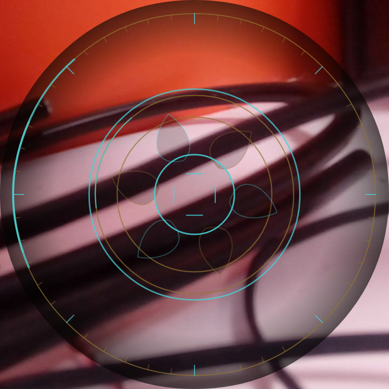
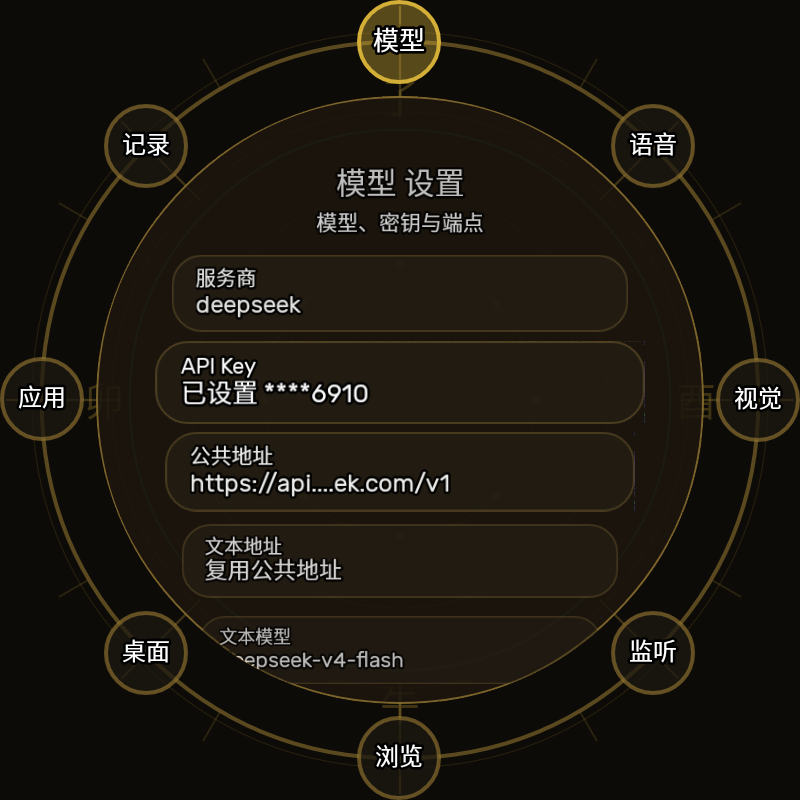
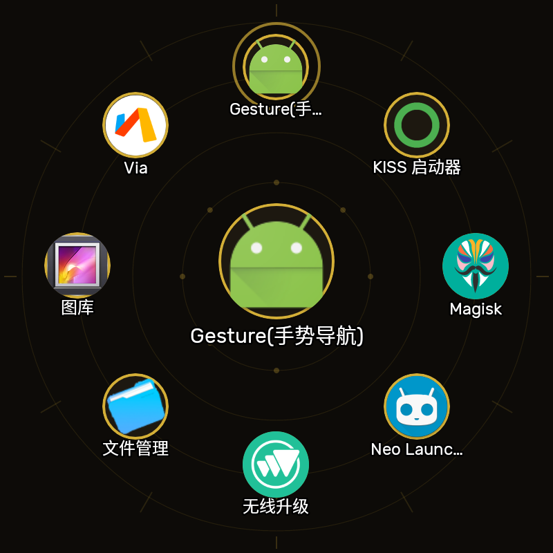

# 真理罗盘

真理罗盘是为 MAGNEO C110001 / MT6580 / 800x800 圆形屏打造的 Android 5.1 桌面 App。它把罗盘主页、八卦导航、设备传感器、AI 对话与视觉、语音、浏览器、网络文件系统和远程设置集中到一个适合小圆屏反复使用的界面里。

## 界面预览

| 主屏 | 金色机械灵眼 |
| --- | --- |
|  |  |
| 设置 | 应用抽屉 |
|  |  |

## 目标设备

- Android 5.1 / API 22：项目 `minSdk 22`、`targetSdk 22`，运行行为按旧系统适配。
- CPU/ABI：MT6580 级别设备，`armeabi-v7a` 单 ABI。
- 屏幕：800x800 圆屏，主界面和设置页都按物理圆屏可触控区域设计。
- 构建工具链：JDK 21、Gradle 8.14.5、Android SDK platform 36、build-tools 36.0.0、NDK 27.0.12077973、CMake 3.22.1。

## 主要功能

- 罗盘桌面：可注册为 HOME 桌面；外圈八区进入应用、网盘、设置、系统设置、音乐、灵眼、浏览和详情。
- 传感器与诊断：显示方位、姿态、电量、磁力、GPS/卫星、光线、近距、气压等状态，并提供磁力校准和硬件诊断页。
- AI 与占筮：支持 OpenAI 兼容的大模型端点，文字和视觉模型可分开配置；卦象可触发本地简解与 AI 解读播报。
- 金色机械灵眼：摄像头画面叠加圆屏机械虹膜，使用颜色和运动区分聆听、思考、播报、定格与错误状态；点击中央可冻结当前画面继续问图。
- 语音系统：支持 VAD 常驻监听、ASR/TTS 接口配置、本地 eSpeak NG 离线 TTS，并注册为系统 TTS 引擎。
- 浏览与文件：内置圆屏 WebView，支持 FTP/WebDAV/SMB/NFS 网络文件浏览、下载、上传和流式播放。
- 远程维护：内置网页设置服务，可查看配置和对话记录，并配合 ADB TCP、frpc、屏幕/摄像头推流做远程调试；ADB 守护会清理死连接并限频自愈。

## 构建

首次从干净仓库构建时，需要额外克隆 eSpeak NG 源码来提供 native 头文件；静态库和精简语音数据已经随仓库提交。

```bash
git clone --depth 1 https://github.com/espeak-ng/espeak-ng.git third_party/espeak-ng
./gradlew assembleRelease
```

生成的 APK 位于 `app/build/outputs/apk/release/`。更多历史构建步骤、圆屏 UI 规范和设备限制已移到 [docs/original-readme.md](docs/original-readme.md)。

## GitHub Release 构建

仓库提供 [Android Release workflow](.github/workflows/android-release.yml)，会在 GitHub runner 上安装 Android 5.1 兼容所需的编译环境：

- `ubuntu-24.04`
- Temurin JDK 21
- Android SDK platform 36 / build-tools 36.0.0
- Android NDK 27.0.12077973
- CMake 3.22.1

触发方式：

- 手动运行 `workflow_dispatch`
- 推送到 `main` 或 `master`
- 推送 `v*` 标签时自动创建 GitHub Release 并上传 APK

默认会上传 release build type 的 unsigned APK、签名 APK、开机动画 Magisk 模块和 SHA256 校验文件，并在缺少签名 secrets 时生成 `app-release-ci-signed.apk` 便于安装测试。这个 CI 临时签名不适合作为长期升级签名；若要产出稳定的正式 signed APK，在仓库 `Settings -> Secrets and variables -> Actions` 中配置：

- `ANDROID_KEYSTORE_BASE64`：release keystore 的 base64 内容
- `ANDROID_KEYSTORE_PASSWORD`
- `ANDROID_KEY_ALIAS`
- `ANDROID_KEY_PASSWORD`

Action 会使用 `zipalign` 和 `apksigner` 签名，并显式启用 v1 签名以兼容 Android 5.1。

## 金色机械开机动画

Release 中的 `oracle-compass-bootanimation-v*.zip` 是为 C110001 / Android 5.1 制作的 Magisk 模块。它以 systemless 方式覆盖 `/system/media/bootanimation.zip`，覆盖该 ROM 的 `curlockscreen=1` 厂商属性，并在开机完成时直接拉起真理罗盘 HOME；不修改原厂文件，在 Magisk 中禁用或卸载模块即可恢复原动画和原厂锁屏行为。

动画固定为 `800x800 / 12fps`：前段 70 帧完成机械眼展开，末段 36 帧以 3 秒周期持续扫描和呼吸，直到系统完成 HOME 交接。由 JDK 21 可复现生成：

```bash
javac -d build/bootanimation-tool tools/BootAnimationGenerator.java
java -Djava.awt.headless=true -cp build/bootanimation-tool BootAnimationGenerator release 0.2.4
```

安装前应确认设备为 API 22 且已安装 Magisk。模块内也会执行同样的兼容性检查。

专用设备如需让开机动画直接衔接真理罗盘，可在确认系统未设置 PIN、图案或密码后，使用 root 关闭仅上滑的锁屏（当前设备已应用）：

```bash
su -c 'settings put secure lockscreen.disabled 1'
```

需要恢复上滑锁屏时执行：

```bash
su -c 'settings put secure lockscreen.disabled 0'
```

真理罗盘作为默认 HOME 时会在开机广播后主动回到主屏；如果系统存在安全凭据，应用不会尝试绕过安全锁屏。

## 文档

- [旧 README 原文](docs/original-readme.md)
- [设备说明](设备说明.md)
- [TTS/ASR 部署](docs/tts-asr-deploy.md)
- [GPS 诊断记录](docs/gps-diagnostic-log.md)
- [儿童机制与防退处理](docs/去除儿童机制-重置操作手册.md)
